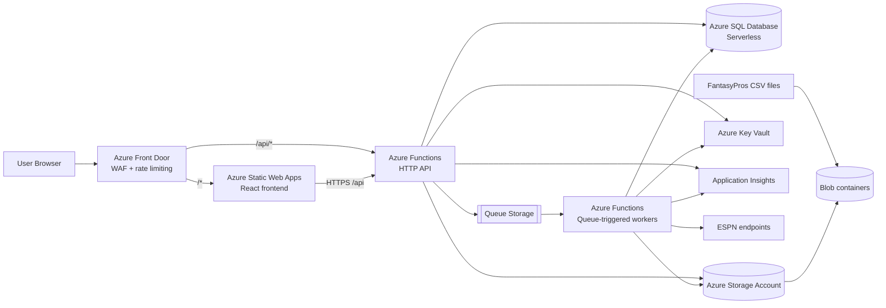

# LeagueBrief Codex-Ready Implementation Plan
## Infrastructure-First Edition

**Project:** LeagueBrief  
**Purpose:** A drop-in implementation plan for Codex and other AI coding agents  
**Priority change in this version:** Define and deploy Azure infrastructure with Bicep **before** writing application code so code can be deployed and tested continuously.

---

## 1. Goal

Build LeagueBrief as an ESPN fantasy football league history and draft prep analytics service with:

- React frontend
- Python backend and workers
- Azure-hosted infrastructure
- shared canonical league data
- provider-based auth
- async imports
- persisted analytics
- support for FantasyPros historical CSV reference data

This plan is optimized for Codex execution and for an **infrastructure-first workflow**.

---

## 2. Existing proof of concept

There is an existing proof of concept located at:

- `docs/espn-fantasy-league-analyzer/`

This proof of concept uses the ESPN API and calculates some of the target metrics in Python.

### How the proof of concept should be used
- Use it as a **reference artifact** during implementation.
- It is useful for understanding ESPN data retrieval patterns, historical league modeling ideas, and metric logic already explored.
- It can help validate assumptions about what data is available and how some metrics might be derived.

### Constraints on using the proof of concept
- New production code must **not** directly import or depend on the proof of concept.
- Do not reference the proof of concept as a runtime dependency.
- Re-implement the needed logic inside the new LeagueBrief architecture.
- Treat the proof of concept as reference material only.

This is important because LeagueBrief should be a clean, standalone implementation with proper boundaries, tests, and deployment structure.

---

## 3. Why infrastructure comes first

For this project, infra should be created before most code because you want to:

- validate Azure resource choices early
- test deployment pipelines continuously
- wire app configuration to real Azure resources
- avoid building code against fake assumptions
- de-risk auth, secrets, storage, SQL, queue, and edge routing

That means the first major implementation milestone is **Bicep-based Azure environment provisioning**, followed by deployment scripts that let you push infra and code into your Azure resource group repeatedly.

---

## 4. Expected final Azure architecture



---

## 5. Required repo structure

```text
leaguebrief/
  AGENTS.md
  README.md
  docs/
    leaguebrief-prd.md
    leaguebrief-implementation-plan.md
    API_SPEC.md
    METRICS.md
    SEQUENCES.md
    espn-fantasy-league-analyzer/
  apps/
    web/
    api/
    worker/
  packages/
    domain/
    analytics-core/
    espn-adapter/
    fantasypros-adapter/
  infra/
    bicep/
      main.bicep
      modules/
      parameters/
    scripts/
      _common.sh
      deploy-infra.sh
      deploy-app-web.sh
      deploy-app-api.sh
      deploy-app-worker.sh
      package-api.sh
      package-worker.sh
      bootstrap-env.sh
  .github/
    workflows/
```

---

## 6. Codex operating rules for this project

Codex should follow these rules on every meaningful task:

1. Read:
   - `AGENTS.md`
   - `docs/leaguebrief-prd.md`
   - this implementation plan

2. Review `docs/espn-fantasy-league-analyzer/` when domain context is needed, but do not directly depend on it.

3. Use a short plan before making large changes.

4. Work in small bounded tasks.

5. Run:
   - tests
   - lint
   - type checks
   - build validation

6. Summarize:
   - changed files
   - assumptions
   - risks/TODOs

7. Do not violate key product invariants:
   - unique league identity by `(platform, external_league_id)`
   - shared league data across users
   - `user_leagues` as authz boundary
   - no raw ESPN secret storage in SQL
   - metrics persisted and versioned

---

## 7. Implementation phases overview

### Phase 0 — Repo bootstrap
Create the monorepo, docs, AGENTS.md, CI skeleton, and command conventions.

### Phase 1 — Infrastructure-first Azure foundation
Define Azure infrastructure with Bicep and create scripts to deploy infra and code.

### Phase 2 — App shells and deployment validation
Create minimal frontend and backend apps and deploy them into the provisioned Azure environment.

### Phase 3 — Auth and schema foundation
Implement provider-based auth and the initial database schema.

### Phase 4 — League create/attach flow
Support canonical league creation and multi-user league attachment.

### Phase 5 — Secrets and job foundation
Implement Key Vault-backed private credential handling and queue/job orchestration.

### Phase 6 — Ingestion and normalization
Implement ESPN raw ingestion, FantasyPros CSV ingestion, and normalization into relational tables.

### Phase 7 — Analytics and dashboards
Compute metrics, expose read APIs, and build the React dashboards.

### Phase 8 — Hardening and polish
Improve observability, retry behavior, deployment scripts, docs, and user experience.

---

## 8. Phase 0 — Repo bootstrap

### Objective
Create a clean repo foundation for Codex and deployment.

### Deliverables
- monorepo structure
- AGENTS.md
- base README
- docs folder with PRD and implementation plan
- root commands for lint, test, typecheck
- GitHub workflow skeletons
- proof of concept copied into `docs/espn-fantasy-league-analyzer/`

### Codex task prompt
```text
Use /plan first.

Bootstrap the LeagueBrief monorepo using the repo structure described in docs/leaguebrief-implementation-plan.md.
Create AGENTS.md, docs, root scripts, and CI skeletons.
Include the existing proof of concept under docs/espn-fantasy-league-analyzer as reference material only.
Acceptance criteria:
- repo structure exists
- docs are present
- root scripts exist for lint, test, and typecheck
- CI workflow skeleton exists
- proof of concept is documented as reference-only
Do not implement business logic yet.
```

---

## 9. Phase 1 — Infrastructure-first Azure foundation

### 9.1 Objective

Provision Azure resources before application code so you can deploy early, validate assumptions, and test continuously.

### 9.2 Required Azure resources

Minimum MVP resources:

- Azure Resource Group
- Azure Front Door
- Azure Static Web App
- Azure Functions app for HTTP API
- Azure Functions app for queue-triggered workers
- Azure Storage Account
- Azure SQL Database serverless
- Azure Key Vault
- Application Insights

Optional later:
- Log Analytics workspace
- deployment slots
- staging environment

### 9.3 Infrastructure design requirements

- Bicep must be the source of truth for infrastructure.
- Infra must be deployable to an existing Azure resource group.
- Parameterization must support at least:
  - environment name
  - location
  - resource name prefix
  - SQL admin settings or reference strategy
  - app configuration values
- Outputs must expose values needed by deployment scripts.
- Bicep should create or configure:
  - storage containers
  - queue names
  - app settings placeholders
  - managed identities where applicable
  - Key Vault access policies or RBAC model

### 9.4 Bicep folder expectations

```text
infra/
  bicep/
    main.bicep
    modules/
      frontdoor-premium.bicep
      log-analytics.bicep
      app-insights.bicep
      staticwebapp.bicep
      functionapp-flex.bicep
      storage.bicep
      sql.bicep
      keyvault.bicep
      role-assignments.bicep
    parameters/
      dev.bicepparam
      prod.bicepparam
```

### 9.5 Deployment script expectations

Create Bash versions for the current macOS-first workflow.

#### Required scripts

- `bootstrap-env.sh`
- `deploy-infra.sh`
- `package-api.sh`
- `package-worker.sh`
- `deploy-app-api.sh`
- `deploy-app-worker.sh`
- `deploy-app-web.sh`

These scripts should support repeatable deployment of infrastructure and application code into your Azure resource group.

### 9.6 Infra-first acceptance criteria

Infrastructure phase is complete when:

- Bicep validates successfully
- Azure resources deploy into the resource group
- outputs are available live from the Azure deployment for app configuration
- deployment scripts run end-to-end
- a placeholder frontend, API, and worker shell can be deployed to the provisioned environment

### 9.7 Codex task prompt for Bicep

```text
Use /plan first.

Implement the LeagueBrief Azure infrastructure in Bicep before application code.
Requirements:
- create Bicep files under infra/bicep
- support deployment into an Azure resource group
- provision resources for Front Door, Static Web Apps, Function Apps, Storage, Azure SQL serverless, Key Vault, and Application Insights
- create required blob containers and queue names for MVP
- expose outputs needed for app deployment and configuration
Acceptance criteria:
- Bicep validates
- parameter files exist for at least dev
- the design is modular, not one giant file
- include a short README under infra/bicep explaining modules and parameters
Do not implement app business logic yet.
```

### 9.8 Codex task prompt for deployment scripts

```text
Use /plan first.

Create deployment scripts for LeagueBrief infrastructure and code.
Requirements:
- add Bash scripts under infra/scripts
- include bootstrap-env, deploy-infra, package-api, package-worker, deploy-app-api, deploy-app-worker, and deploy-app-web
- scripts should consume live Azure deployment outputs where appropriate
- scripts should fail fast on missing prerequisites
Acceptance criteria:
- scripts are documented
- scripts are idempotent where practical
- scripts are safe to run repeatedly in a dev environment
- deploy-infra should use direct az deployment group create without persisting local deployment metadata or Bicep outputs
Do not require manual editing inside the scripts for ordinary execution.
```

---

## 10. Phase 2 — App shells and deployment validation

### Objective
Create minimal frontend and backend apps and prove they deploy to the new Azure environment.

### Deliverables
- React frontend shell
- Python API shell
- Python worker shell placeholder
- `apps/web/staticwebapp.config.json` aligned to Azure Front Door forwarding requirements for the production public host
- health endpoint
- simple home page
- deployment validation

### Important rule
This phase is about **deployability**, not business logic.

### Codex task prompt
```text
Use /plan first.

Implement minimal deployable app shells for LeagueBrief.
Requirements:
- apps/web: React + TypeScript shell with Home and placeholder routes
- apps/api: Python API shell with /api/health
- apps/worker: placeholder Python worker shell aligned with the deployment scripts
- align environment configuration to the Azure resources provisioned by infra scripts
Acceptance criteria:
- frontend builds locally
- backend starts locally
- the API and web app can be deployed with the existing deployment scripts
- the worker shell structure is ready for the existing worker packaging and deployment scripts
- the frontend shell includes Static Web Apps forwarding-gateway configuration for the Front Door hostname, the production custom domain, and the expected `X-Azure-FDID` header
- document required environment variables
Do not add auth or database access yet.
```

---

## 11. Phase 3 — Auth and schema foundation

### Objective
Implement provider-based auth and the foundational relational schema.

### Deliverables
- internal user model
- auth provider mapping
- migrations
- schema access layer
- `/api/me`

### Codex task prompt
```text
Use /plan first.

Implement the LeagueBrief auth and schema foundation.
Requirements:
- support Google and Microsoft sign-in in the schema design
- create users and auth_provider_accounts tables
- implement /api/me
- add the MVP schema migrations from the PRD
Acceptance criteria:
- migrations run successfully
- internal users are created or updated correctly
- schema constraints for canonical league uniqueness are present
Do not implement account linking UI yet.
```

---

## 12. Phase 4 — League create / attach flow

### Objective
Support canonical league creation and cheap second-user attach behavior.

### Deliverables
- `POST /api/leagues`
- `GET /api/leagues`
- `POST /api/leagues/{leagueId}/attach`
- `user_leagues` authz checks
- canonical league reuse

### Codex task prompt
```text
Use /plan first.

Implement the LeagueBrief league create and attach flow.
Requirements:
- create or find canonical leagues by (platform, external_league_id)
- attach current user through user_leagues
- prevent duplicate canonical league creation
- enforce league-scoped authorization through user_leagues
Acceptance criteria:
- two users submitting the same ESPN league map to one canonical league row
- users can each belong to multiple leagues
- tests cover duplicate prevention and authorization
```

---

## 13. Phase 5 — Secrets and async job foundation

### Objective
Implement private league credentials and the async import framework.

### Deliverables
- Key Vault-backed credential handling
- queue message schema
- `import_jobs`
- `job_tasks`
- `job_events`
- worker skeleton
- import start endpoint

### Codex task prompt
```text
Use /plan first.

Implement LeagueBrief private credential handling and async job foundation.
Requirements:
- support submitting espn_s2 and SWID for a user-league access path
- store only secret references in SQL
- add queue-backed import job creation and worker skeleton
- support job types initial_import, attach_existing_league, refresh_current_data, recompute_metrics, ingest_fantasypros
Acceptance criteria:
- raw secrets are never stored in SQL
- creating an import creates an import_jobs row and queue message
- worker transitions status through validating/running/succeeded
```

---

## 14. Phase 6 — ESPN ingestion, FantasyPros ingestion, and normalization

### Objective
Fetch raw data, store it, and normalize it into canonical shared tables.

### Use of proof of concept in this phase
The proof of concept in `docs/espn-fantasy-league-analyzer/` is especially relevant here for reference.
It may help with:
- understanding ESPN fetch flows
- understanding historical data shape expectations
- comparing metric ideas

However:
- do not import from it
- do not wire it into runtime code
- do not shortcut architecture boundaries by reusing it directly

### Deliverables
- ESPN adapter
- raw snapshot storage
- FantasyPros CSV ingestion
- normalization logic
- coverage/freshness updates
- idempotent upsert behavior

### Codex task prompt for ESPN raw ingestion
```text
Use /plan first.

Implement the LeagueBrief ESPN adapter and raw ingestion flow.
Requirements:
- isolate ESPN integration in packages/espn-adapter
- fetch league metadata and historical season data needed for MVP
- store raw payloads in blob storage
- create raw_snapshots rows
- the existing proof of concept under docs/espn-fantasy-league-analyzer may be reviewed as reference only
Acceptance criteria:
- adapter boundaries are clean
- worker can fetch and persist raw snapshots
- tests use fixtures or mocks where practical
- no direct dependency on the proof of concept is introduced
```

### Codex task prompt for FantasyPros ingestion
```text
Use /plan first.

Implement LeagueBrief FantasyPros CSV ingestion.
Requirements:
- ingest static historical CSV files into reference_files, player_reference, reference_rankings, and reference_ranking_items
- keep ingestion idempotent or safely versioned
- document player matching assumptions
Acceptance criteria:
- sample CSVs ingest successfully
- reference tables populate correctly
```

### Codex task prompt for normalization
```text
Use /plan first.

Implement LeagueBrief normalization from raw snapshots into canonical relational tables.
Requirements:
- upsert seasons, season_data_coverage, managers, teams, matchups, drafts, draft_picks, and transactions as available
- preserve league and season uniqueness
- update completeness and freshness markers
Acceptance criteria:
- re-running normalization is idempotent
- duplicate rows are not created
- shared league data remains canonical across users
```

---

## 15. Phase 7 — Analytics core and dashboard APIs

### Objective
Compute persisted metrics and expose them through API routes.

### Use of proof of concept in this phase
The proof of concept may be reviewed to understand previously explored metric logic.
It should not be referenced directly by the new source tree.

### Deliverables
- framework-independent analytics package
- metric definitions and versions
- league/manager/team metrics
- overview/managers/draft endpoints
- retry/status endpoints

### Codex task prompt for analytics
```text
Use /plan first.

Implement the LeagueBrief analytics core.
Requirements:
- keep analytics logic framework-independent
- compute and persist league_metrics, manager_metrics, and team_metrics
- tie metrics to metric_definitions and versions
- support recompute_metrics jobs using normalized data only
- the proof of concept under docs/espn-fantasy-league-analyzer may be reviewed as reference only
Acceptance criteria:
- MVP metrics are persisted
- dashboard reads do not trigger full recompute
- representative metric tests exist
- no direct dependency on the proof of concept is introduced
```

### Codex task prompt for API reads
```text
Use /plan first.

Implement the LeagueBrief read APIs for the MVP dashboards.
Requirements:
- add endpoints for league overview, managers, manager detail, draft analytics, and job status
- authorize league access through user_leagues
- serve persisted analytics and normalized data
Acceptance criteria:
- unauthorized users cannot access leagues they are not attached to
- responses are documented in docs/API_SPEC.md
```

---

## 16. Phase 8 — Frontend MVP dashboards and polish

### Objective
Build the user-facing product and refine deployment/testing.

### Deliverables
- Home
- My Leagues
- League Overview
- Manager Profile
- Draft Analytics
- Import Status
- About / Support
- Buy Me a Coffee link
- loading/empty/error states

### Codex task prompt
```text
Use /plan first.

Implement the LeagueBrief frontend MVP.
Requirements:
- create polished React pages for Home, My Leagues, League Overview, Manager Profile, Draft Analytics, Import Status, and About/Support
- use the deployed API and real data where available
- include loading, error, and empty states
- include a tasteful Buy Me a Coffee link
Acceptance criteria:
- a user can sign in, attach a league, start an import, check status, and read the core dashboards
- the UI uses the LeagueBrief brand consistently
```

---

## 17. Required docs Codex should maintain

### `docs/API_SPEC.md`
Define request/response shapes for all public endpoints.

### `docs/METRICS.md`
Define formulas and meanings for:
- luck index
- start/sit efficiency
- draft value vs consensus
- all-play record
- rivalry metrics
- all-time record summaries

### `docs/SEQUENCES.md`
Include sequence diagrams for:
- first user full import
- second user attach
- current season refresh
- recompute metrics
- deploy infra and deploy code

### `infra/bicep/README.md`
Explain:
- module structure
- parameters
- outputs
- deployment sequence

### `infra/scripts/README.md`
Explain:
- prerequisites
- login/setup
- script order
- examples

---

## 18. What to review manually even when using Codex

You should personally review:

- all Bicep modules
- all deployment scripts
- auth logic
- SQL migrations
- authorization checks
- Key Vault usage
- queue/job state transitions
- normalization idempotency
- metrics definitions
- any broad refactor

---

## 19. Recommended first five Codex tasks

### Task 1
Bootstrap repo, docs, AGENTS.md, and CI.

### Task 2
Implement Bicep infrastructure modules and parameter files.

### Task 3
Implement deployment scripts for infra and code.

### Task 4
Implement minimal deployable frontend and backend app shells.

### Task 5
Validate end-to-end deployment into the Azure resource group and confirm health endpoints work.

This order is deliberate. It ensures you can deploy and test before deeper application logic begins.

---

## 20. Definition of done for the infrastructure-first foundation

The project is ready for application feature development when:

- Bicep files are present and modular
- parameter files exist for at least dev
- infra deployment scripts work
- code deployment scripts work
- Azure resources are provisioned successfully
- minimal web and API shells are deployed successfully
- configuration values flow from infra outputs into deployment steps
- `/api/health` works in deployed Azure
- the frontend can be reached publicly

---

## 21. Drop-in reusable Codex prompts

### General setup
```text
Use /plan first. Read AGENTS.md, docs/leaguebrief-prd.md, and docs/leaguebrief-implementation-plan.md before making changes.
```

### Infra-only
```text
Implement this task in an infrastructure-first way. Do not add app business logic yet. Ensure Bicep and deployment scripts are reviewable, documented, and safe to rerun.
```

### Code deployability
```text
Prioritize deployability over feature depth. The output should be something I can deploy and smoke test in Azure.
```

### Safety constraints
```text
Do not introduce password auth, direct payment processing, duplicate league data per user, or raw ESPN secret storage in SQL.
```

### Validation
```text
Before finishing, run tests, lint, type checks, and any available build validation. Summarize changed files and any assumptions.
```

---

## 22. Final short summary for AI agents

Build LeagueBrief in this order:

1. bootstrap repo and docs  
2. define Azure infrastructure in Bicep  
3. create scripts to deploy infra and code into the Azure resource group  
4. deploy minimal frontend and backend shells  
5. add auth and schema  
6. implement league create/attach  
7. implement secrets and async jobs  
8. implement ESPN and FantasyPros ingestion  
9. normalize shared league data  
10. compute persisted analytics  
11. build dashboard APIs and React UI  
12. harden, document, and polish

The proof of concept in `docs/espn-fantasy-league-analyzer/` may be used as reference material during implementation, but it must not be directly referenced by the new source code.

The most important workflow rule is:

> **Infrastructure and deployment come before feature implementation so every stage can be deployed and tested in Azure.**
