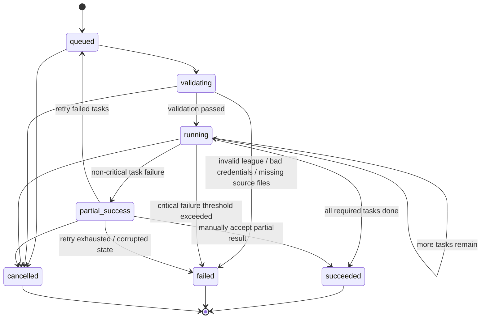

# LeagueBrief
## Product Requirements Document / Design Document
**Version:** 0.1  
**Author:** John + ChatGPT  
**Status:** Draft for implementation  
**Product name:** LeagueBrief  
**Primary goal:** Provide a complete handoff document that AI coding agents can use to implement the MVP.

---

## 1. Executive Summary

LeagueBrief turns existing fantasy football collection and analysis scripts into a web-based analytics service for ESPN fantasy football leagues.

The service will let users sign in, connect ESPN leagues, import historical league data once, compute league-specific analytics, and explore dashboards that help them understand their league's history and prepare for future drafts.

The MVP is intentionally optimized for:

- portfolio value
- practical personal use
- low Azure spend
- a clean engineering story for LinkedIn/resume
- future extensibility toward monetization
- a clean public brand under LeagueBrief.com

Initial monetization is limited to a tasteful support link such as a **Buy Me a Coffee** button. The MVP is free to use.

### 1.1 Branding decision
- Product name: **LeagueBrief**
- Primary domain: **LeagueBrief.com**
- Suggested repo/org slug: `leaguebrief`
- Suggested Azure resource prefix: `lb` or `leaguebrief`

---

## 2. Product Vision

Build LeagueBrief as a web app that gives ESPN fantasy football users deep, league-specific historical insight.

The app should answer questions like:

- Who are the best and worst drafters in this league?
- Who gets lucky every year?
- Who leaves the most points on the bench?
- Which strategies have historically worked in this specific league?
- Which managers consistently reach for players?
- What patterns in this league are actually predictive of success?

The core differentiation is not generic fantasy football advice. It is:

> **League-specific intelligence built from your league's own history.**

---

## 3. Product Goals

### 3.1 MVP goals

- Allow a user to sign in with Google or Microsoft
- Allow a user to connect one or more ESPN leagues
- Import historical league data asynchronously
- Avoid re-importing and re-computing the same league for every user
- Persist historical data and analytics
- Display useful dashboards for league history and draft prep
- Support FantasyPros historical CSV ingestion for draft comparison features
- Fit within a modest Azure budget
- Be credible as a portfolio project and technical case study

### 3.2 Non-goals for MVP

- No email/password auth
- No custom payment system
- No live in-season player projections
- No trade calculator
- No chat assistant over league data
- No Sleeper/Yahoo support
- No admin console unless needed for simple maintenance
- No subscription billing/paywalls in MVP

---

## 4. Target Users

### Primary user
An ESPN fantasy football manager who wants to understand their league's history and prepare for upcoming seasons.

### Secondary users
- Friends and family in shared leagues
- People from LinkedIn/GitHub who want to try the app
- Commissioners who want a richer league-history view

---

## 5. Core Product Principles

1. **Shared league data**
   - Historical league data should be fetched and computed once per league whenever possible.

2. **Async ingestion**
   - ESPN import and analytics should run in background jobs, not synchronous web requests.

3. **Precomputed analytics**
   - Metrics should be persisted and served quickly, not recomputed on every request.

4. **Low operational complexity**
   - The MVP should use as few moving parts as possible while still being production-like.

5. **Provider-based auth**
   - Use third-party identity providers for sign-in instead of building password auth.

6. **User-specific private-league access**
   - A league is shared, but ESPN credentials may belong to individual users.

7. **Budget discipline**
   - Architecture choices should fit a rough Azure budget of ~$120/month.

---

## 6. MVP Scope

### 6.1 Included MVP features

#### Authentication
- Sign in with Google
- Sign in with Microsoft
- Internal user record mapped to provider identities

#### League onboarding
- User can add an ESPN league by league ID
- Support private league credential submission (`espn_s2`, `SWID`)
- User can attach to an already-imported league

#### Historical ingestion
- Import historical league seasons
- Ingest FantasyPros historical CSV reference data
- Store raw source payloads
- Normalize into a relational model
- Compute league, manager, and team analytics

#### Dashboards / views
- League overview
- Manager profile pages
- Draft analytics pages
- Historical standings/champions
- Key metrics for league prep

#### Jobs / orchestration
- Async import jobs
- Job progress/status
- Retry support
- Partial success handling

#### Support / sharing
- Public marketing/landing page branded as LeagueBrief
- Footer links to GitHub and support page
- Buy Me a Coffee button/link

### 6.2 Out-of-scope features
- Subscription billing
- Mobile app
- Native ESPN OAuth integration
- Live weekly assistant features
- Social features/comments
- Multi-tenant enterprise features
- Public league discovery/search

---

## 7. Success Criteria

### Functional
- A user can sign in successfully
- A user can add an ESPN league
- The system imports league history successfully
- A second user joining the same league does not trigger unnecessary full historical re-import
- Users can view core dashboards without expensive live recomputation

### Product
- The app is usable by real friends/family
- The app is shareable on LinkedIn/GitHub
- The product feels polished and coherent
- The app produces at least a few "wow, that's interesting" league insights

### Engineering
- App is deployed in Azure
- The system logs jobs and failures clearly
- Secrets are not stored in plaintext SQL
- The architecture is explainable in interviews

---

## 8. User Stories

### 8.1 Authentication
- As a new user, I want to sign in with Google so I do not need to create a password.
- As a new user, I want to sign in with Microsoft so I can use an account I already trust.
- As a returning user, I want my prior leagues and analytics to still be available after sign-in.

### 8.2 League onboarding
- As a user, I want to enter my ESPN league so the app can analyze it.
- As a user in a private league, I want to provide the required ESPN cookies so the app can access the league.
- As a user in a league that is already in the system, I want to attach to the existing league without waiting for a full re-import.

### 8.3 League understanding
- As a user, I want to see historical champions, standings, and league trends.
- As a user, I want to see all-time manager performance in one place.
- As a user, I want to understand rivalries and long-term league narratives.

### 8.4 Draft preparation
- As a user, I want to see who tends to reach early in drafts.
- As a user, I want to compare draft picks to historical FantasyPros rankings/ADP.
- As a user, I want to see which managers have historically drafted well or poorly.

### 8.5 Operational visibility
- As a user, I want to know whether my import is queued, running, failed, or completed.
- As a user, I want to retry a failed import rather than starting over blindly.

### 8.6 Project support
- As a user who likes the app, I want a simple support button so I can tip the creator.

---

## 9. Functional Requirements

### 9.1 Authentication
- The system shall support Google sign-in.
- The system shall support Microsoft sign-in.
- The system shall map provider identities to an internal app user.
- The system shall not require passwords in MVP.

### 9.2 League identity and reuse
- The system shall uniquely identify a league by `(platform, external_league_id)`.
- The system shall prevent duplicate canonical league records.
- The system shall allow multiple users to attach to the same league.
- The system shall reuse previously imported league data whenever possible.

### 9.3 Private league credentials
- The system shall allow a user to provide ESPN private-league credentials.
- The system shall store credential references, not raw secrets, in the main relational database.
- The system shall store secrets in a secret store such as Azure Key Vault.

### 9.4 Ingestion and jobs
- The system shall support async jobs for imports and recomputes.
- The system shall store job state and subtask progress.
- The system shall support retries.
- The system shall allow partial success where appropriate.

### 9.5 Data import
- The system shall ingest ESPN league history.
- The system shall ingest FantasyPros historical CSV files required for MVP analytics.
- The system shall store raw snapshots in object/blob storage.
- The system shall normalize imported data into relational tables.

### 9.6 Analytics
- The system shall persist computed metrics.
- The system shall version metric definitions.
- The system shall recompute metrics only when required by stale data or new metric versions.

### 9.7 Frontend
- The system shall provide a React web frontend.
- The frontend shall allow a user to view league dashboards, manager views, and draft analytics.
- The frontend shall show job/import status.
- The frontend shall include a support link/button.

---

## 10. Non-Functional Requirements

### 10.1 Security
- No plaintext password storage
- No plaintext storage of ESPN private league cookies in SQL
- Secrets stored in Key Vault
- Authorization checks on all league-scoped endpoints
- WAF/rate limiting at the edge

### 10.2 Performance
- Dashboard reads should use precomputed or efficiently queryable data
- Long-running imports should be asynchronous
- Repeated imports of the same historical league should be minimized

### 10.3 Reliability
- Failed job subtasks should be retryable
- Poison message patterns should be handled by the queue/worker architecture
- Job audit trails should exist

### 10.4 Cost
- The app should run comfortably within the target Azure budget during MVP
- Avoid always-on infrastructure when possible
- Avoid unnecessary duplicate imports or recomputes

### 10.5 Maintainability
- Ingestion logic shall be separated from analytics logic
- Analytics shall be separated from web/API concerns
- The codebase should be modular and AI-agent friendly

---

## 11. Recommended MVP Features in UI

### 11.1 League Overview Page
- League name and settings summary
- Champions by year
- Standings by year
- All-time wins / points leaderboard
- Playoff appearances
- Overall narratives or summary cards

### 11.2 Manager Profile Page
- All-time record
- Points for / against
- Championships and playoff appearances
- Start/sit efficiency
- Luck index
- Best/worst seasons
- Draft behavior summary

### 11.3 Draft Prep Page
- Reach tendencies by manager
- Draft value vs consensus
- Position preference by round
- Best/worst historical picks
- League drafting archetypes

### 11.4 Import Status UI
- Queued / running / failed / succeeded
- Last successful refresh
- Partial success and retry paths

### 11.5 Support / About
- Project description
- GitHub link
- Tasteful Buy Me a Coffee button

---

## 12. Architecture Overview

### 12.1 High-level architecture

```mermaid
flowchart LR
    U[User Browser]

    FD[Azure Front Door<br/>WAF + rate limiting]
    SWA[Azure Static Web Apps<br/>React frontend]
    API[Azure Functions<br/>HTTP API (Python/FastAPI-style)]
    APPINSIGHTS[Application Insights]

    SQL[(Azure SQL Database<br/>Serverless)]
    KV[Azure Key Vault]
    STG[(Azure Storage Account)]
    BLOB[(Blob Containers<br/>raw snapshots / csv / exports)]
    QUEUE[[Queue Storage<br/>import-jobs]]
    ESPN[ESPN endpoints]
    FP[FantasyPros CSV files]

    WORKER[Azure Functions<br/>Queue-triggered workers]

    U --> FD
    FD -->|/*| SWA
    FD -->|/api/*| API

    API --> SQL
    API --> KV
    API --> QUEUE
    API --> BLOB
    API --> APPINSIGHTS

    FP -->|admin upload / seeded files| BLOB
    QUEUE --> WORKER
    WORKER --> ESPN
    WORKER --> BLOB
    WORKER --> SQL
    WORKER --> KV
    WORKER --> APPINSIGHTS

    SWA -->|HTTPS /api| API
```

### 12.2 Architectural layers

#### Frontend layer
- React + TypeScript
- Static Web Apps hosting
- Provider-based auth
- Dashboard UI
- Import status UI

#### API layer
- Python API endpoints
- League onboarding
- Job creation
- Dashboard reads
- Authorization checks

#### Worker layer
- Queue-triggered async workers
- ESPN fetch
- FantasyPros ingest
- Normalization
- Analytics compute

#### Data layer
- Azure SQL Database serverless for canonical relational data
- Blob storage for raw payloads and CSV source files
- Queue Storage for async job execution
- Key Vault for secrets

---

## 13. Concrete Azure Service Mapping

### Edge / web
- **Azure Front Door**
  - WAF
  - Rate limiting
  - Path-based routing
  - Protect backend from abusive traffic

- **Azure Static Web Apps**
  - React hosting
  - Frontend deployment

### Compute
- **Azure Functions (HTTP)**
  - API endpoints
  - Auth/session integration
  - Job enqueueing

- **Azure Functions (Queue-triggered)**
  - Import workers
  - Recompute workers
  - FantasyPros ingest

### Data
- **Azure SQL Database Serverless**
  - Primary relational store

- **Azure Storage Account**
  - Blob containers:
    - `raw-espn`
    - `fantasypros-source`
    - `exports`
    - `job-artifacts`
  - Queue(s):
    - `import-jobs`

- **Azure Key Vault**
  - `espn_s2`
  - `SWID`

### Monitoring
- **Application Insights**
  - Logs
  - Traces
  - Errors
  - Job performance telemetry

---

## 14. Cost Strategy

### Target
Stay aligned with approximately **$120/month** in Azure spend.

### Cost discipline principles
- Prefer consumption/serverless where reasonable
- Use one relational database
- Use one storage account for blobs + queue
- Persist analytics to avoid repeated compute
- Reuse shared league data across users
- Use Front Door to reduce origin abuse, but do not assume blocked traffic is free
- Avoid always-on services unless necessary

### Services most likely to matter for cost
1. Azure SQL Database serverless
2. Front Door baseline + traffic
3. Functions execution volume
4. Blob storage retention

### Cost-sensitive design decisions
- Queue Storage instead of more advanced messaging for MVP
- Avoid duplicate league imports
- Auto-manage old raw blobs later via lifecycle policies
- Keep FantasyPros data as static reference ingestion, not a live external integration

---

## 15. Shared League Data Strategy

A major MVP requirement is that league history should ideally be fetched and computed once per league.

### Required behavior
- The first user who adds a league may trigger a full import
- The second user who adds the same league should attach to the existing canonical league record
- Historical data should not be re-fetched unless stale or incomplete
- Metrics should not be recomputed unless source data changed or metric version changed

### Design implications
- `leagues` must be unique on `(platform, external_league_id)`
- League data must be league-scoped, not user-scoped
- User access must be represented separately from league identity
- Credentials may be user-specific even when league data is shared

---

## 16. Authentication Strategy

### Decision
Use provider-based sign-in instead of building password auth.

### MVP providers
- Google
- Microsoft

### Rationale
- Lower scope
- Better default security posture
- Less account-recovery/reset work
- Familiar user experience
- Clean portfolio story

### Design rule
Use an internal `users` table plus a provider-mapping table.  
Do not make the rest of the app depend directly on Google or Microsoft IDs.

---

## 17. Buy Me a Coffee Strategy

### MVP approach
- Add a footer or support-page button/link on LeagueBrief
- Use the external Buy Me a Coffee platform
- Do not build custom payment processing
- Do not gate features behind tips

### Product principle
Support links should be present but not intrusive.

---

## 18. Data Model (Final MVP Schema)

This schema is designed so that:

- authentication is handled by external identity providers
- your app still owns its own internal user model
- one person can sign in through Google or Microsoft and map to the same app user
- league data is shared across users
- a league is imported once and reused
- private league credentials remain user-specific
- analytics are persisted and versioned

### 18.1 Auth and user identity tables

#### `users`
Canonical app user record.

- `id` (uuid, pk)
- `primary_email`
- `display_name`
- `profile_image_url` (nullable)
- `status` (`active`, `disabled`)
- `created_at`
- `updated_at`
- `last_login_at`

**Constraints**
- recommended: `UNIQUE(primary_email)`

#### `auth_provider_accounts`
Links a user to one or more external auth provider identities.

- `id` (uuid, pk)
- `user_id` (fk `users.id`)
- `provider` (`google`, `microsoft`)
- `provider_subject`
- `email`
- `email_verified` (bool)
- `display_name` (nullable)
- `profile_image_url` (nullable)
- `last_login_at`
- `created_at`
- `updated_at`

**Constraints**
- `UNIQUE(provider, provider_subject)`
- recommended: `UNIQUE(user_id, provider)`

#### Optional: `user_sessions`
For MVP, this may be omitted if auth/session management is handled externally.

- `id` (uuid, pk)
- `user_id` (fk `users.id`)
- `provider_account_id` (fk `auth_provider_accounts.id`)
- `session_started_at`
- `session_expires_at` (nullable)
- `last_seen_at`
- `ip_address` (nullable)
- `user_agent` (nullable)

### 18.2 Core app tables

#### `leagues`
Canonical shared league record.

- `id` (uuid, pk)
- `platform` (`espn`)
- `external_league_id`
- `name`
- `scoring_type`
- `is_private`
- `timezone`
- `first_season`
- `last_season`
- `created_by_user_id` (fk `users.id`)
- `data_completeness_status` (`not_started`, `partial`, `complete`, `stale`)
- `last_imported_at`
- `last_computed_at`
- `last_successful_refresh_at`
- `created_at`
- `updated_at`

**Constraints**
- `UNIQUE(platform, external_league_id)`

#### `user_leagues`
Connects app users to leagues they can access in the app.

- `id` (uuid, pk)
- `user_id` (fk `users.id`)
- `league_id` (fk `leagues.id`)
- `role` (`owner`, `viewer`)
- `joined_at`
- `created_at`

**Constraints**
- `UNIQUE(user_id, league_id)`

### 18.3 User-specific league credential tables

#### `league_access_credentials`
Stores private-league credential references for a user’s access to a league.

- `id` (uuid, pk)
- `league_id` (fk `leagues.id`)
- `user_id` (fk `users.id`)
- `credential_type` (`espn_cookie_pair`)
- `key_vault_secret_name_s2`
- `key_vault_secret_name_swid`
- `status` (`active`, `invalid`, `revoked`, `expired`)
- `is_preferred_for_refresh` (bool)
- `last_verified_at`
- `created_at`
- `updated_at`

**Constraints**
- recommended: `UNIQUE(league_id, user_id, credential_type)`

### 18.4 Import and orchestration tables

#### `import_jobs`
Top-level async job record.

- `id` (uuid, pk)
- `league_id` (fk `leagues.id`)
- `requested_by_user_id` (fk `users.id`)
- `job_type` (`initial_import`, `attach_existing_league`, `refresh_current_data`, `recompute_metrics`, `ingest_fantasypros`)
- `status` (`queued`, `validating`, `running`, `partial_success`, `succeeded`, `failed`, `cancelled`)
- `current_phase` (`validate`, `fetch`, `normalize`, `compute`, `finalize`)
- `priority`
- `requested_seasons_json`
- `started_at`
- `completed_at`
- `last_heartbeat_at`
- `error_summary`
- `created_at`

#### `job_tasks`
Worker-level subtask tracking.

- `id` (uuid, pk)
- `job_id` (fk `import_jobs.id`)
- `task_type` (`fetch_season`, `fetch_draft`, `fetch_matchups`, `normalize_season`, `compute_manager_metrics`, `compute_league_metrics`)
- `season`
- `status` (`queued`, `running`, `succeeded`, `failed`, `skipped`)
- `attempt_count`
- `started_at`
- `completed_at`
- `error_message`
- `worker_instance_id`

#### `job_events`
Append-only event log.

- `id` (bigint, pk)
- `job_id` (fk `import_jobs.id`)
- `event_type`
- `message`
- `payload_json`
- `created_at`

### 18.5 Raw/source tracking tables

#### `raw_snapshots`
Tracks raw ESPN payloads stored in Blob Storage.

- `id` (uuid, pk)
- `league_id` (fk `leagues.id`)
- `season`
- `snapshot_type` (`league_meta`, `draft`, `matchups`, `rosters`, `transactions`)
- `blob_path`
- `source_hash`
- `is_current` (bool)
- `fetched_at`

#### `reference_files`
Tracks FantasyPros source CSV files.

- `id` (uuid, pk)
- `source` (`fantasypros`)
- `season`
- `file_type` (`adp`, `rankings`, `tiers`)
- `blob_path`
- `version_label`
- `ingested_at`

### 18.6 League history tables

#### `seasons`
One row per league season.

- `id` (uuid, pk)
- `league_id` (fk `leagues.id`)
- `season_year`
- `settings_json`
- `team_count`
- `regular_season_weeks`
- `playoff_weeks`
- `champion_team_id` (nullable)
- `runner_up_team_id` (nullable)
- `import_status` (`not_started`, `partial`, `complete`, `stale`)
- `stats_fresh_as_of`
- `last_import_job_id` (fk `import_jobs.id`, nullable)
- `last_computed_job_id` (fk `import_jobs.id`, nullable)
- `created_at`

**Constraints**
- `UNIQUE(league_id, season_year)`

#### `season_data_coverage`
Tracks which data domains are present for a season.

- `id` (uuid, pk)
- `season_id` (fk `seasons.id`)
- `has_draft_data` (bool)
- `has_matchup_data` (bool)
- `has_transaction_data` (bool)
- `has_roster_data` (bool)
- `has_reference_rankings` (bool)
- `last_validated_at`

**Constraints**
- `UNIQUE(season_id)`

#### `managers`
Canonical manager identities within a league.

- `id` (uuid, pk)
- `league_id` (fk `leagues.id`)
- `external_manager_id`
- `display_name`
- `normalized_name`
- `first_seen_season`
- `last_seen_season`

**Constraints**
- recommended: `UNIQUE(league_id, external_manager_id)`

#### `teams`
A manager’s team in a specific season.

- `id` (uuid, pk)
- `season_id` (fk `seasons.id`)
- `manager_id` (fk `managers.id`)
- `external_team_id`
- `team_name`
- `abbrev`
- `wins`
- `losses`
- `ties`
- `points_for`
- `points_against`
- `final_standing`
- `made_playoffs`
- `is_champion`

**Constraints**
- recommended: `UNIQUE(season_id, external_team_id)`

#### `matchups`
All season matchups.

- `id` (uuid, pk)
- `season_id` (fk `seasons.id`)
- `week_number`
- `matchup_type` (`regular`, `playoff`)
- `home_team_id` (fk `teams.id`)
- `away_team_id` (fk `teams.id`)
- `home_score`
- `away_score`
- `winner_team_id` (fk `teams.id`, nullable)
- `is_complete`

#### `weekly_team_scores`
Weekly actual vs optimal performance data.

- `id` (uuid, pk)
- `season_id` (fk `seasons.id`)
- `team_id` (fk `teams.id`)
- `week_number`
- `actual_points`
- `optimal_points`
- `bench_points`
- `lineup_efficiency`
- `all_play_wins`
- `all_play_losses`

**Constraints**
- `UNIQUE(team_id, week_number)`

#### `drafts`
One draft per season.

- `id` (uuid, pk)
- `season_id` (fk `seasons.id`)
- `draft_date`
- `draft_type`
- `pick_count`

**Constraints**
- recommended: `UNIQUE(season_id)`

#### `draft_picks`
All picks in a season’s draft.

- `id` (uuid, pk)
- `draft_id` (fk `drafts.id`)
- `team_id` (fk `teams.id`)
- `overall_pick`
- `round_number`
- `round_pick`
- `player_name`
- `player_external_id`
- `position`
- `nfl_team`
- `fantasypros_rank_id` (nullable)
- `fantasypros_adp` (nullable)
- `reach_value` (nullable)
- `value_delta` (nullable)

**Constraints**
- recommended: `UNIQUE(draft_id, overall_pick)`

#### `transactions`
Optional but useful for waiver analytics.

- `id` (uuid, pk)
- `season_id` (fk `seasons.id`)
- `team_id` (fk `teams.id`, nullable)
- `week_number`
- `transaction_type` (`add`, `drop`, `trade`, `waiver`)
- `player_name`
- `player_external_id`
- `created_at_source`

### 18.7 Reference ranking tables

#### `player_reference`
Canonical player identity mapping.

- `id` (uuid, pk)
- `canonical_player_name`
- `position`
- `nfl_team`
- `external_keys_json`

#### `reference_rankings`
One source/version of imported historical rankings.

- `id` (uuid, pk)
- `season`
- `source` (`fantasypros`)
- `ranking_type` (`overall_rank`, `adp`, `ppr_adp`, `half_ppr_adp`)
- `format`
- `scoring`
- `published_label`
- `created_at`

#### `reference_ranking_items`
Rows within a ranking source.

- `id` (uuid, pk)
- `reference_ranking_id` (fk `reference_rankings.id`)
- `player_reference_id` (fk `player_reference.id`)
- `rank_value`
- `adp_value`
- `position_rank`
- `raw_player_name`
- `raw_team`
- `raw_position`

### 18.8 Metric definition and analytics tables

#### `metric_definitions`
Defines metric identity and version.

- `id` (uuid, pk)
- `metric_name`
- `metric_version`
- `description`
- `is_current` (bool)
- `created_at`

**Constraints**
- `UNIQUE(metric_name, metric_version)`

#### `league_metrics`
League-level computed analytics.

- `id` (uuid, pk)
- `league_id` (fk `leagues.id`)
- `season_id` (fk `seasons.id`, nullable)
- `metric_definition_id` (fk `metric_definitions.id`)
- `metric_value_json`
- `computed_at`
- `job_id` (fk `import_jobs.id`)

#### `manager_metrics`
Manager-level computed analytics.

- `id` (uuid, pk)
- `league_id` (fk `leagues.id`)
- `manager_id` (fk `managers.id`)
- `season_id` (fk `seasons.id`, nullable)
- `metric_definition_id` (fk `metric_definitions.id`)
- `metric_value_numeric` (nullable)
- `metric_value_json` (nullable)
- `rank_within_league`
- `computed_at`
- `job_id` (fk `import_jobs.id`)

#### `team_metrics`
Season-specific team analytics.

- `id` (uuid, pk)
- `team_id` (fk `teams.id`)
- `season_id` (fk `seasons.id`)
- `metric_definition_id` (fk `metric_definitions.id`)
- `metric_value_numeric` (nullable)
- `metric_value_json` (nullable)
- `computed_at`
- `job_id` (fk `import_jobs.id`)

### 18.9 MVP metrics to persist
- all-time wins
- all-time points
- championships
- playoff appearances
- average draft reach
- draft value vs consensus
- start/sit efficiency
- luck index
- all-play record
- rivalry record
- waiver activity count
- best picks / worst picks

---

## 19. Job Lifecycle / State Machine

### 19.1 Job statuses
- `queued`
- `validating`
- `running`
- `partial_success`
- `succeeded`
- `failed`
- `cancelled`

### 19.2 Job phases
- `validate`
- `fetch`
- `normalize`
- `compute`
- `finalize`

### 19.3 State machine



### 19.4 Worker rules
- Default max attempts per task: 3
- Exponential backoff on retry
- Optional/non-critical tasks may allow job-level `partial_success`
- Required tasks failing should move the job to `failed`

### 19.5 Job types
- `initial_import`
- `attach_existing_league`
- `refresh_current_data`
- `recompute_metrics`
- `ingest_fantasypros`

---

## 20. Core API Surface (Suggested)

### Auth / session
- `GET /api/me`
- `POST /api/logout` (if needed in your auth setup)

### Leagues
- `GET /api/leagues`
- `POST /api/leagues`
- `GET /api/leagues/{leagueId}`
- `POST /api/leagues/{leagueId}/attach`
- `POST /api/leagues/{leagueId}/credentials`

### Imports / jobs
- `POST /api/leagues/{leagueId}/imports`
- `GET /api/jobs/{jobId}`
- `POST /api/jobs/{jobId}/retry`

### Dashboards
- `GET /api/leagues/{leagueId}/overview`
- `GET /api/leagues/{leagueId}/managers`
- `GET /api/leagues/{leagueId}/managers/{managerId}`
- `GET /api/leagues/{leagueId}/draft`
- `GET /api/leagues/{leagueId}/seasons`
- `GET /api/leagues/{leagueId}/season/{seasonYear}`

### Support/about
- Static frontend route for About / Support page

---

## 21. Suggested Repo / Code Organization

```text
leaguebrief/
  apps/
    web/
      src/
        pages/
        components/
        features/
        lib/
    api/
      src/
        routes/
        auth/
        services/
        models/
        repositories/
        workers/
        analytics/
        ingestion/
        utils/
  packages/
    domain/
      models/
      schemas/
      constants/
    analytics-core/
      metrics/
      transforms/
      draft/
      matchup/
    espn-adapter/
      clients/
      parsers/
      normalizers/
    fantasypros-adapter/
      ingest/
      mapping/
  infra/
    bicep/
    scripts/
  docs/
    leaguebrief-prd.md
```

### Boundary guidance
- `analytics-core`: pure calculation logic
- `espn-adapter`: external ingestion and parsing
- `fantasypros-adapter`: CSV/reference data ingestion
- `api`: HTTP endpoints, orchestration, persistence
- `web`: UI only

---

## 22. Implementation Notes for AI Agents

### 22.1 Critical invariants
- A league is globally unique by `(platform, external_league_id)`
- `user_leagues` is the source of authorization for league access
- ESPN secrets never live directly in the main SQL tables
- Historical data should not be duplicated per user
- Metrics should be tied to metric definition/version

### 22.2 Priority implementation order
1. Auth integration
2. Core DB schema
3. League create/attach flow
4. Job system with queue and workers
5. ESPN ingestion
6. FantasyPros CSV ingest
7. Normalization
8. Metric computation
9. Dashboard API routes
10. Frontend pages
11. Support/about page

### 22.3 Things agents should avoid
- Do not implement custom password auth
- Do not build direct payment processing
- Do not re-fetch full historical league data if the canonical league is already complete and current
- Do not make dashboard requests trigger full recomputation

# LeagueBrief PRD Addendum: Existing Proof of Concept

There is an existing proof of concept located at:

- `docs/espn-fantasy-league-analyzer/`

This proof of concept uses the ESPN API and calculates some of the target metrics in Python.

## How it should be used
- It may be used as a reference during implementation.
- It is useful for understanding domain logic, ESPN data availability, and previously explored metric ideas.
- It can help inform architecture decisions, schema design, ingestion strategy, and metric formulas.

## Constraints
- New production source code must not directly import or depend on this proof of concept.
- The proof of concept should not be wired into runtime application paths.
- Needed logic should be re-implemented cleanly within the new LeagueBrief architecture.

## Why
LeagueBrief should remain a standalone, maintainable system with clear boundaries, tests, and deployment workflows.
---

## 23. Risks and Open Questions

### 23.1 ESPN data access risk
The system depends on ESPN-access methods that may be unofficial or subject to change.  
Mitigation: isolate ESPN integration behind an adapter layer.

### 23.2 Private league credential handling
Handling private league cookies raises sensitivity requirements.  
Mitigation: Key Vault + strict secret handling + minimal logging.

### 23.3 Metric correctness
Some metrics may be tricky or easy to define inconsistently.  
Mitigation: define metric formulas clearly and version them.

### 23.4 Player name matching
FantasyPros and ESPN player naming may not line up perfectly.  
Mitigation: maintain `player_reference` mapping and reconciliation logic.

### 23.5 Cost drift
Public sharing may increase traffic or abuse.  
Mitigation: Front Door WAF/rate limiting, persisted analytics, shared league reuse.

### 23.6 Multi-provider identity linking
The schema supports account linking, but UI behavior for linking Google + Microsoft to one user may be deferred.  
MVP decision: optional, not required for first release.

---

## 24. MVP Delivery Plan

### Phase 1: Foundation
- Set up repo and infra
- Set up auth
- Create schema and migrations
- Implement base API and frontend shell

### Phase 2: Core ingestion
- League create/attach flow
- Credential capture and Key Vault storage
- Queue + worker pipeline
- Raw snapshot storage
- Basic normalization

### Phase 3: Analytics
- FantasyPros ingest
- Draft analytics
- League overview metrics
- Manager metrics

### Phase 4: Product polish
- Dashboard UI polish
- Job status/retry UX
- About/support page
- Buy Me a Coffee link
- Logging and error visibility

---

## 25. Definition of Done for MVP

The MVP is done when:

- Users can sign in with Google or Microsoft
- A user can add an ESPN league
- The system imports and stores historical league data
- The system ingests required FantasyPros CSVs
- A second user can attach to an existing league without unnecessary heavy re-import
- Core league overview and draft-prep dashboards work
- Job status is visible
- The app is deployed on Azure
- The app includes a tasteful support link
- The project is polished enough to share on LinkedIn/GitHub

---

## 26. Immediate Next Artifacts to Generate

Recommended next implementation artifacts:

1. SQL DDL or ORM models
2. API endpoint contract spec
3. Bicep/Terraform Azure infrastructure spec
4. Queue message schemas
5. Metric formula definitions
6. Page-by-page frontend spec
7. Seed/reference file ingestion plan
8. Sequence diagrams for:
   - first-user full import
   - second-user attach
   - refresh current season

---

## 27. Branding and Naming Conventions

### Official product name
- **LeagueBrief**

### Public domain
- **LeagueBrief.com**

### Naming conventions
- GitHub org/repo slug: `leaguebrief`
- Frontend app name: `leaguebrief-web`
- API app name: `leaguebrief-api`
- Shared package prefix: `leaguebrief-*`
- Azure resource prefix: `lb` or `leaguebrief`

### Branding guidance
- Use **LeagueBrief** consistently in the UI, docs, repo names, and deployment resources.
- Avoid mixing old working titles such as "Fantasy Football League Analytics Service" in user-facing contexts.
- Support/about copy should describe LeagueBrief as a fantasy football league history and draft prep analytics service for ESPN leagues.

## 28. Short Summary for AI Agents

Build LeagueBrief as a React + Azure Static Web Apps frontend backed by Python Azure Functions.  
Use provider-based auth (Google/Microsoft) mapped to an internal user table.  
Use a canonical shared `leagues` model unique by `(platform, external_league_id)` so league history is fetched and computed once whenever possible.  
Store raw ESPN and FantasyPros inputs in Blob Storage, normalized/shared data in Azure SQL serverless, secrets in Key Vault, and async import jobs in Queue Storage + worker Functions.  
Persist versioned metrics for league, manager, and team analytics.  
Support second-user attach behavior, private league credentials, and a tasteful Buy Me a Coffee link under the LeagueBrief brand.
